# Bem-vindo ao meu perfil! 👋

<table border="0" style="border: none;">
  <tr border="0" style="border: none;">
    <td width="10%" valign="top" border="0" style="border: none;"> 
       <h5>📫 Contatos</h5>

  </td>
  <td width="90%" border="0" style="border: none;">

  </td>
  </tr>
</table>

## 🛠️ Tecnologias e Ferramentas

